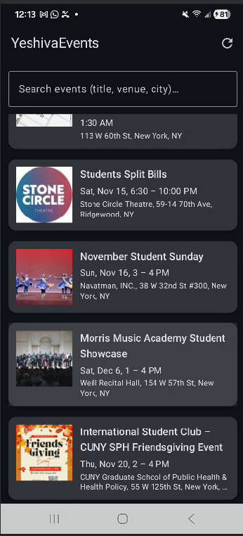
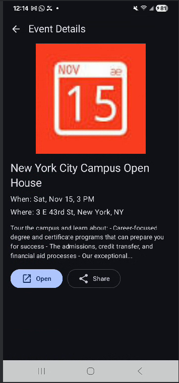
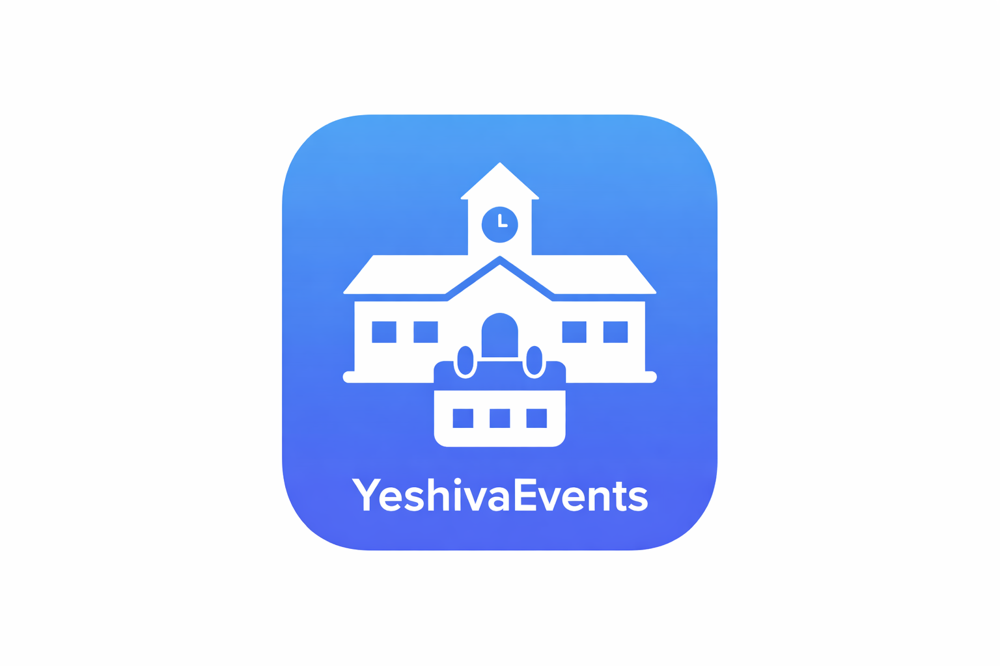

# YeshivaEvents  
### A Campus & Community Event Discovery Android Application

**Author:** Tafirenyika Bonfrey Chatukuta  
**Course:** COM 5210 – Mobile Computing & App Development  
**Instructor:** Ariella Silver  
**Semester:** Fall 2025  
**Assignment Type:** Individual Project  

---

## 📌 Project Overview

**YeshivaEvents** is an Android mobile application designed to help students easily discover, explore, and manage campus and nearby community events related to Yeshiva University and the surrounding New York City area.

The application centralizes event information that is often scattered across multiple platforms (emails, flyers, websites), providing users with a clean, intuitive, and mobile-friendly experience.

---

## 🎯 Problem Statement

Yeshiva University students frequently miss important academic, social, and community events due to:

- Fragmented event information sources  
- Lack of centralized access  
- Limited filtering and discovery tools  

There is a need for a single, reliable mobile platform that aggregates events and presents them in an organized and user-friendly way.

---

## 💡 Solution

**YeshivaEvents** addresses this problem by providing:

- A centralized event feed  
- Intuitive browsing and searching  
- Detailed event views  
- Saved / favorite events  
- Offline-aware data handling  

The app is built using modern Android development best practices to ensure scalability, maintainability, and performance.

---

## ✨ Key Features

- 📅 View a list of upcoming campus and nearby events  
- 🔍 Search events by title or keyword  
- 🏷️ Filter events by category  
- ⭐ Save favorite events for later reference  
- 📄 View detailed event information  
- 🔄 Pull-to-refresh for updated content  
- 📡 Graceful handling of loading, error, and empty states  

---

## 🧱 Architecture Overview

UI (Jetpack Compose)
↓
ViewModel (StateFlow / MVI)
↓
Repository
↓
Remote API / Local Database (Room)

---

## 🛠️ Tech Stack

- Kotlin  
- Jetpack Compose  
- MVVM + MVI  
- Retrofit  
- Room  
- Coroutines  

---

## 📸 Screenshots

### Home Screen

### Event Details Screen

### Error / Empty State

### App Icon

---

## 📄 License

This project is developed for **academic purposes only** and is **not intended for commercial use**.

